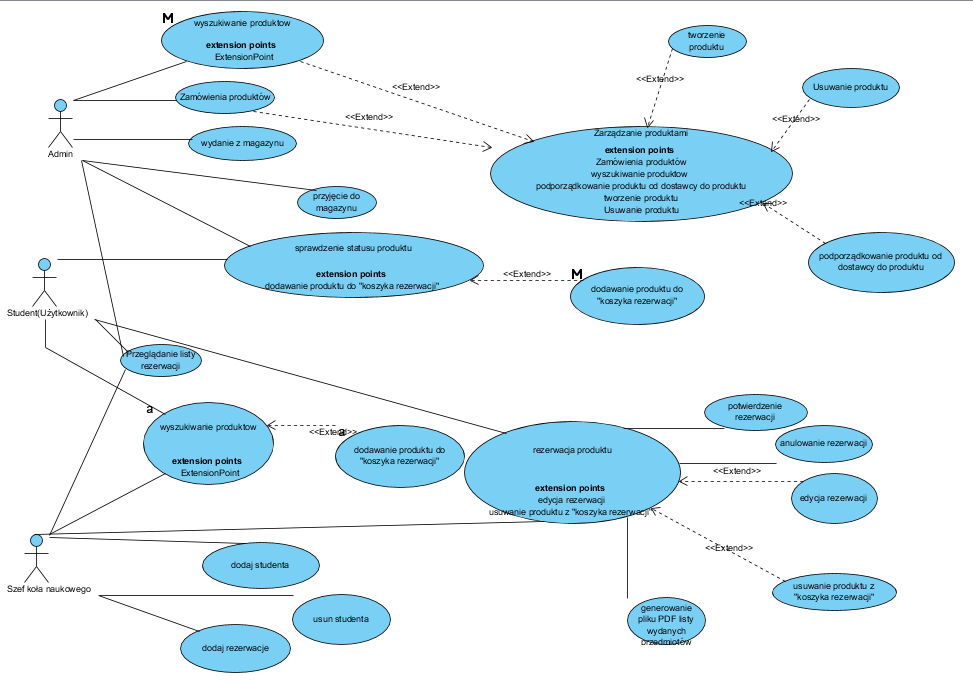
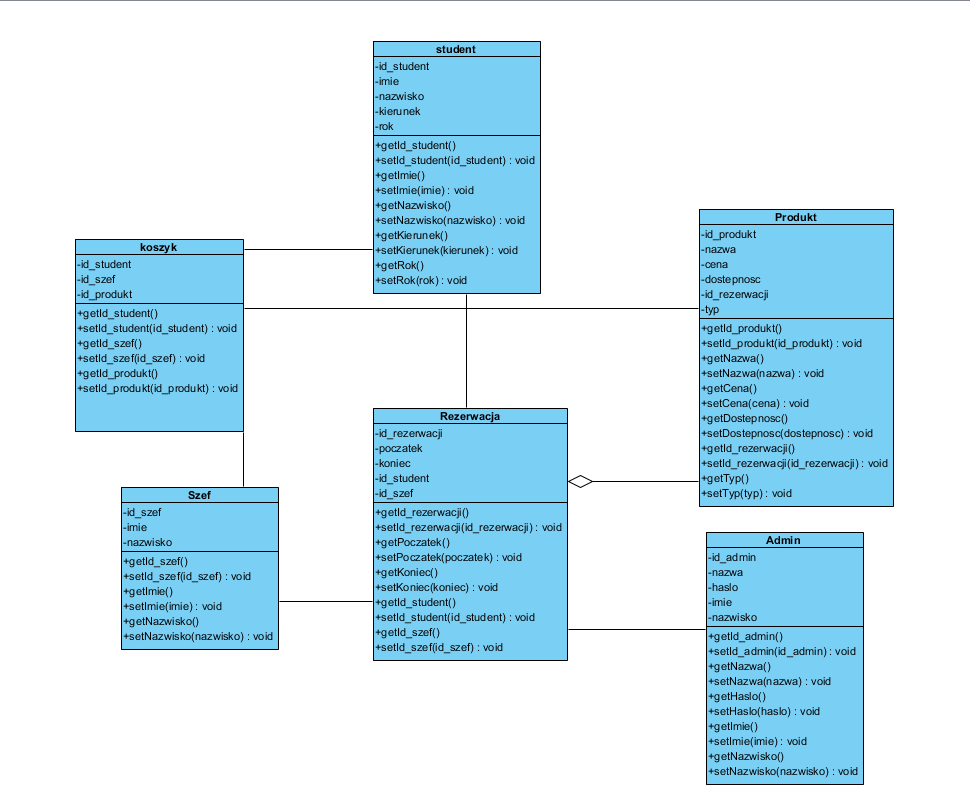
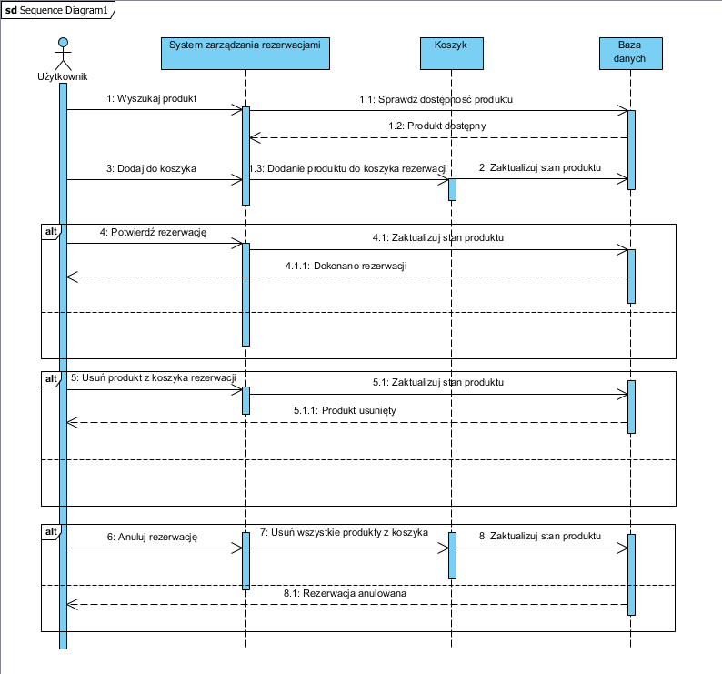

# Aplikacja desktopowa do obsługi pracowni Protolab

## 1.Cele Projektu
Projekt ma na celu zaprojektowanie oraz wykonanie desktopowego narzędzia do obsługi pracowni Protolab. Istnieje tam możliwość zarówno rezerwacji sali jak i samego sprzętu. tu
Za rozumienie pracowni ProtoLab mamy na myśli magazyn przechowujący różne sprzęty elektryczne i elektroniczne, narzędzia itp., a zaprojektowany program miał by za zadanie obsługę tego magazynu 
pod kątem rezerwacji lub wypożyczenia sprzętu studentowi lub szefowi koła naukowego.

## 2.Interesariusze
W projekcie będzie istniało trzech interesariuszy:
* Student(Użytkownik)- ma on możliwość sprawdzenia dostępności produktów w magazynie jak i zarezerwowania go lub anulowania tej rezerwacji.
* Administrator(Magazynier) - ma on takie same prawa jak Student i ponadto może on wyszukiwać konkretne produkty. Może również wydawać i przyjmować  produkty z magazynu oraz aktualizować listę produktów (ma możliwość zamawiania nowych produktów, jak i usuwania wybranych produktów).
* Szef koła naukowego - Również posiada on takie prawa ja Student i ponadto odpowiada za konta użytkowników. Może tworzyć nowe konta użytkowników oraz usuwać już istniejące konta użytkowników.
Każdy z wyżej wymienionych użytkowników, aby korzystać z systemu musi przejść proces logowania.

## 3.Przechowywane dane
W systemie będą przechowywanie dane na temat:
* Danych osobowych osób które wypożyczyły dany produkt.
* Kont użytkowników i ich dane logowania (Login i hasło)
* produktów znajdujących się w magazynie z uwzględnieniem rezerwacji 
* produktów znajdujących się aktualnie w koszyku rezerwacji

W celu potwierdzenia rezerwacji jak i wydania produktu z magazynu wydawany jest wydruk paragonu dla użytkownika przez Administratora.

## 4.Wymagania funkcjonalne:
System będzie miał za zadanie udostępnienie użytkownikowi danego produktu.
 Aby użytkownik mógł dokonać rezerwacji musi on posiadać konto które może stworzyć Szef koła naukowego.
 Po uzyskaniu takiego konta użytkownik może przeglądać listę dostępnych produktów oraz rezerwacje poprzez dodanie produktu do koszyka. 
 Po zatwierdzeniu rezerwacji następuje wydanie przez administratora danego produktu oraz wydruk paragonu potwierdzającego wydanie produktu.
 Ponieważ zakładamy że z systemu będą korzystali osoby o różnej randze czytaj Szef koła naukowego, Studenci, oraz Magazynier(Administrator), jest potrzeba zabezpieczenia danych
po przez  hasłowany dostęp do konta.
 
## 5.Wymagania niefunkcjonalne:
System będzie posiadał przyjazny i prosty w obsłudze interfejs z którego obsługą użytkownicy nie powinni mieć problemów.
 Ponadto dostarczona zostanie dokumentacja dla użytkowników, która będzie miała za zadanie przekazać w jaki sposób korzystać z funkcjonalności programu.
 Program będzie pracował na systemie Windows. Będzie mogło z niego korzystać kilku użytkowników: student(użytkownik), administrator oraz szef koła naukowego.
 System będzie działał na wszystkich obecnie używanych komputerach ze względu na niewielkie wymagania sprzętowe. Ostatecznym terminem wykonania projektu jest 06.06.2018.
 
## 6.Schematy

Diagram aktywności

Diagram klas

Diagram sekwencji

Schemat erd bazy danych